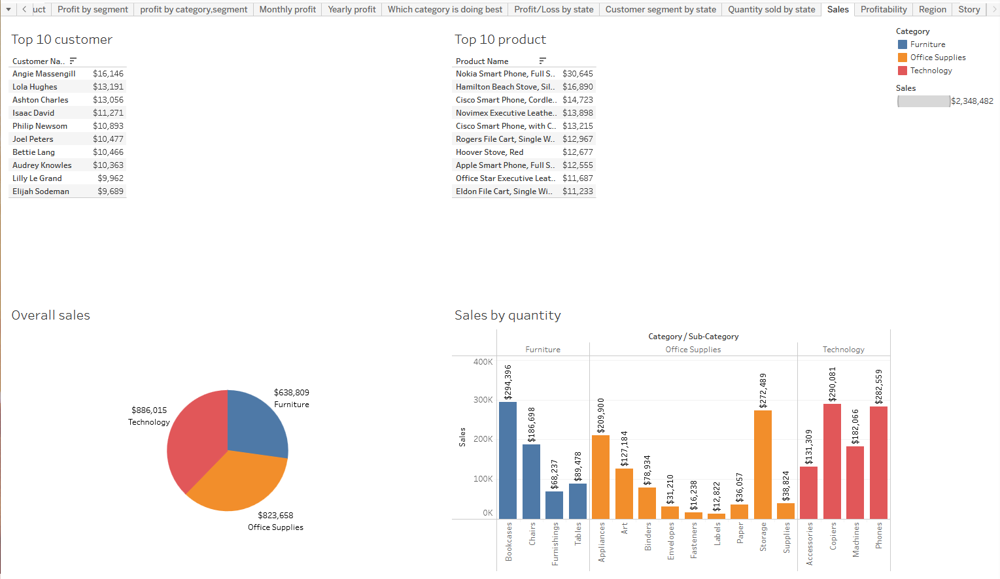
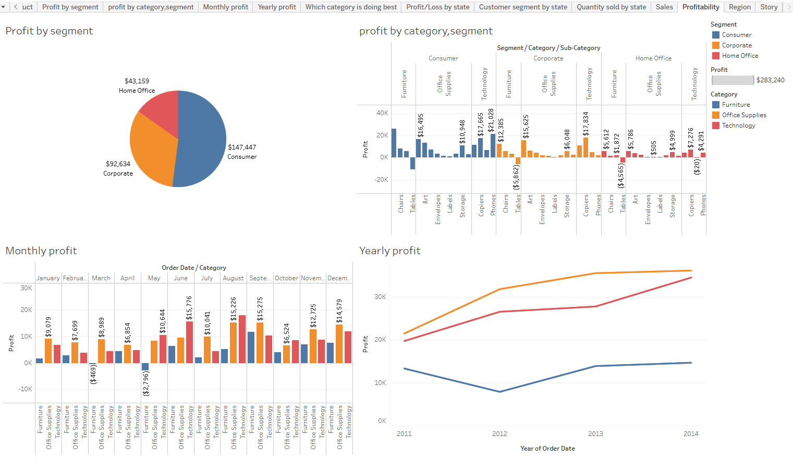

# Projects
## Following are my projects in Tableau & PowerBI:  
#### *You can take a look at my personal website : [ekram.pro](https://ekram.pro/)*  
#### *You can also take a look at my Linkedin : [A. S. M. Ekram Hossain](https://www.linkedin.com/in/a-s-m-ekram-hossain-ba837ab7/)*  

- [x] **####Tableau** -
      - Amazing Mart EU Analysis Project  
      *See on Tableau Public:* **[Story](https://public.tableau.com/app/profile/m.ekram.hossain/viz/amazin-mart-eu-report/Story1)** 

    - Superstore Analysis Project 

    - Superstore2 Analysis Project 

- [x] **####PowerBI** -
    - Baverage brand sales Analysis Project 

    - Global superstore sales Analysis Project

    - Global superstore 2 sales and profit Analysis Project 

    - Shipment Analysis Project 

